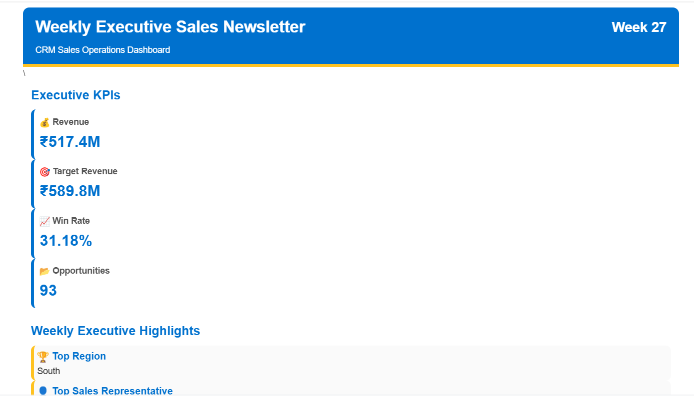
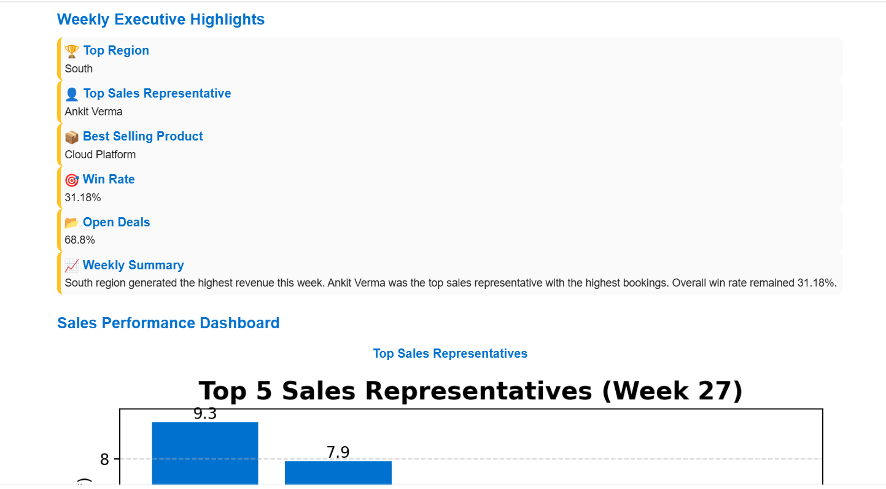

# Automated CRM Sales Analytics & Newsletter Pipeline

## Overview

This project is an end-to-end CRM Sales Analytics and Newsletter Automation system developed using Python. It automatically processes weekly CRM sales data, calculates business KPIs, generates visualizations, creates an executive HTML newsletter using Jinja2 templates, and emails it to stakeholders through Gmail SMTP.

The complete workflow is fully automated using Windows Task Scheduler, eliminating manual reporting and enabling timely business insights.

---

## Features

* Automated weekly CRM sales data processing
* Calculates key business KPIs

  * Total Revenue
  * Target Revenue
  * Win Rate
  * Total Opportunities
  * Top Sales Representative
  * Top Region
  * Best Selling Product
* Generates business charts using Matplotlib
* Creates responsive HTML newsletter using Jinja2
* Sends email automatically using Gmail SMTP
* Secure credential management using `.env`
* Fully automated weekly execution using Windows Task Scheduler

---

## Technologies Used

* Python
* Pandas
* Matplotlib
* Jinja2
* HTML & CSS
* Gmail SMTP
* Python-dotenv
* Windows Task Scheduler
* Git & GitHub

---

## Project Structure

```
Automated-CRM-Sales-Analytics-and-Newsletter-Pipeline/
│
├── data/
├── notebooks/
├── src/
│   ├── main.py
│   ├── config.py
│   ├── data_loader.py
│   ├── kpi_calculator.py
│   ├── chart_generator.py
│   ├── render_newsletter.py
│   └── email_sender.py
│
├── templates/
│   └── newsletter_template.html
│
├── requirements.txt
├── .gitignore
├── Run_Newsletter.bat
└── README.md
```

---

## Workflow

1. Load CRM Sales Excel data
2. Filter current week's records
3. Calculate business KPIs
4. Generate sales charts
5. Render HTML newsletter
6. Send newsletter through Gmail SMTP
7. Execute automatically every Friday using Windows Task Scheduler

---

## Installation

Clone the repository

```bash
git clone https://github.com/vijay-done/Automated-CRM-Sales-Analytics-and-Newsletter-Pipeline.git
```

Create a virtual environment

```bash
python -m venv venv
```

Activate the virtual environment

Windows

```bash
venv\Scripts\activate
```

Install dependencies

```bash
pip install -r requirements.txt
```

Create a `.env` file

```
SENDER_EMAIL=your_email@gmail.com
EMAIL_PASSWORD=your_gmail_app_password
```

Run the project

```bash
python src/main.py
```

---

## Future Improvements

* Interactive Power BI Dashboard
* Database Integration
* Cloud Deployment
* Email Scheduling using Cloud Services
* PDF Newsletter Export

---

## Author

**Vijay Done**

Computer Science and Business Systems Engineer

GitHub: https://github.com/vijay-done

## 📸 Project Screenshots

### Executive Newsletter



---

### Sales Performance Dashboard


